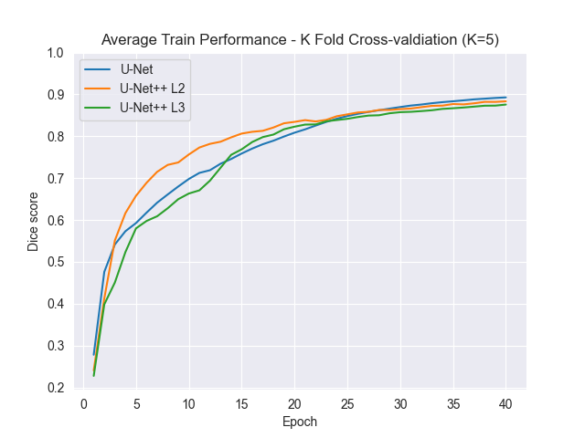
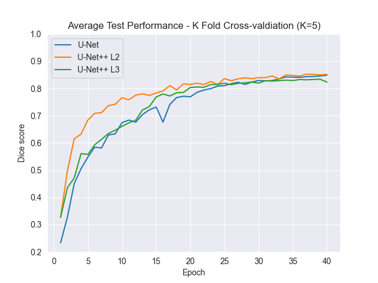

# Volumetric Approaches to Renal Segmentation in Deep Learning
Convolutional neural networks are effective in extracting relevant features from image data. Specifically, U-Net
architectures are popular in medical imaging as a promising
method for deep learning-based segmentation. Many of the U-Net
architectures use MRI data to produce segmentations however,
they utilise 2D operations for downsampling and upsampling.
This study approaches a 3D based solution to solve segmentation
problems which aim to better utilise volumetric MRI data.
Three network architectures (U-Net, U-Net++ L2, U-Net++ L3)
were implemented as 3D architectures to evaluate and compare
network performance in renal segmentation.
## Overview
This repository contains the code for the convolutional neural network - MudNet that identifies AD-converters and their risk of conversion within a 24 months.
* ```train.py``` defines that model training and its parameters
* ```utils``` folder contains:
  * ```callbacks.py``` utility functions using callbacks
  * ```data_loader.py``` loads and prepares renal MRI
  * ```model.py``` defines U-Net architectures and their parameters
  * ```preprocess.py``` contains pre-processing methods (e.g. Fuzzy Normalisation)
## Results
 

